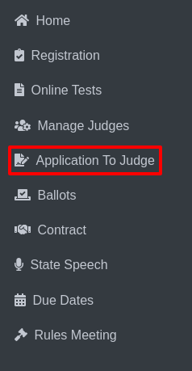

Judges Submission
===========================

* Select **Application To Judge** from the sidebar.

* This section presents two options: **Manage Zones** and **Judges Submission**.

.. thumbnail:: ../../../images/application-to-judges/judges-sub/menu-2.png

* Click on **Judges Submission** to access registered judges who have not submitted an Application to Judge.

.. thumbnail:: ../../../images/application-to-judges/judges-sub/sub-menu-3.png

* Two categories will be displayed: **Play Production** and **Speech**. Select one to view further details.

* On this page, the following options are available:

    * **Home** button to return to the main Judges Submission page.

    * **Export** button to export the list of Registered Judges who have not submitted an Application to Judge.

    .. thumbnail:: ../../../images/application-to-judges/judges-sub/not-submitted-play-4.png

    * **Copy** Emails button to copy the email addresses of judges who have not submitted an application.

    * A summary showing the **number of judges** who have not submitted an application out of the total judges.

**Sorting:** 

* **Sort by Name** and **Sort by Email** buttons to organize the list alphabetically by name or email. Upon clicking, entries will appear in alphabetical order.

**Before Sorting:**

.. thumbnail:: ../../../images/application-to-judges/judges-sub/sorting-before-5.png

**After Sorting:**

.. thumbnail:: ../../../images/application-to-judges/judges-sub/sorting-after-6.png