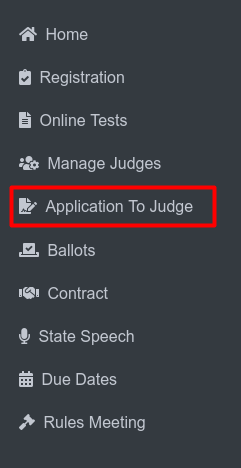

Manage Zones
===========================

**Side Menu**
 

Clicking **Application To Judges** from side menu this will redirects the user to the **Application To Judges** page.

.. thumbnail:: ../../../images/application-to-judges/manage-zones/manage-zones.png
   :title: Appilcation to Judge page..

Clicking **Manage Zones** button, this will redirects the user to the **Manage Zones** page.

.. thumbnail:: ../../../images/application-to-judges/manage-zones/manage-zones1.png
   :title:  Manage Zones page.

**Activity Selection:** After selecting the **Manage Zones** button, this UI allows users to choose between different activities such as “Play Production” or “Speech.” This will filter the **Manage Zones** according to the chosen activity.

**Manage Zones for Play Production**

.. thumbnail:: ../../../images/application-to-judges/manage-zones/manage_zonesPP.png
   :title: Manage Zones for Play Production.

This page displays all current play production zones with each zone having:

Zone Name: The name of the geographical area (e.g., Ainsworth/Broken Bow Area).

City List: A list of cities included in each respective zone.

**Total Zones Count (No. 1) :** Displays the total number of zones currently managed in the selected category (either Play Production or Speech).
 
**Create New Zone Button (No. 2) :** Button labeled "Create New Zone". Allows users to add a new zone to the selected contest type (Play Production or Speech).

**(No.3)** is a dropdown or toggle switch that allows users to select between Play Production and Speech zones.It enables switching between managing zones for Play Production and Speech without leaving the page

**Delete Button (No. 4):** Button labeled "Delete Selected". Allows users to delete one or more selected zones from the list of the current contest type. Users must select the zones they want to delete by marking checkboxes next to the zone names.

**Manaze Zones for Speech**

.. thumbnail:: ../../../images/application-to-judges/manage-zones/manage-zonesSP.png
   :title: Manage Zones for Speech.

.. thumbnail:: ../../../images/application-to-judges/manage-zones/create_zoneSP.png
   :title: Create  New Zones.

**(No.1)** Type the desired name for the new zone in this field.
Then mark the checkboxes for each city that should be part of the new zone. Multiple cities can be selected.

**(No.2)** After entering a zone name and selecting cities, click Save Changes to create the zone. The new zone will then appear in the list of zones for the selected contest type (Play Production or Speech).