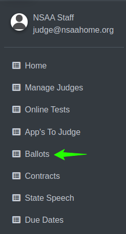

Ballots List
===========================

==========================
1. Accessing the Ballots:
==========================

* Begin by navigating to the ballot section where you can manage and review judging assignments.

==========================
2. Selecting Judge Types:
==========================

.. thumbnail:: ../../../images/ballots/ballot-lists/2.select-judges-type.png

* Use the dropdown menu to choose the appropriate judge type, such as **Speech** or **Play Production**. This selection filters the data relevant to the chosen event.

.. thumbnail:: ../../../images/ballots/ballot-lists/3.judges-type-edit.png
   :width: 250px

================================
3. Selecting a School and Role:
================================

.. thumbnail:: ../../../images/ballots/ballot-lists/4.ballot-lists.png

* Once a judge type is selected, you will see dropdowns for selecting a school and a role. Choose the desired school and then select either **AD** or **Coach**.

.. thumbnail:: ../../../images/ballots/ballot-lists/5.select-coach-edit.png
   :width: 250px

.. thumbnail:: ../../../images/ballots/ballot-lists/6.select-school-edit.png
   :width: 250px

======================
* After making these selections, the **Search Bar** will automatically become **active**.

.. thumbnail:: ../../../images/ballots/ballot-lists/7.save-changes.png

* When the search bar is active, you can type in various search criteria, such as the **first name**, **last name**, or **city**, to narrow down your results.

.. thumbnail:: ../../../images/ballots/ballot-lists/8.showing-search-results.png

* As you type, the system will dynamically show results that match your search input.

* Once you've made any adjustments or selected results in the search bar, click the Save Changes button to confirm and store your updates.
