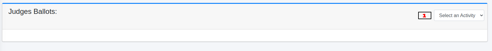
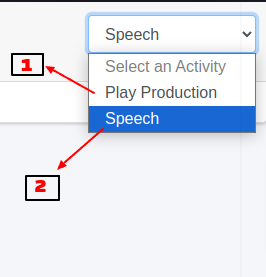
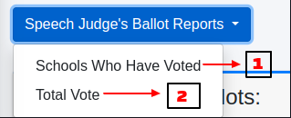
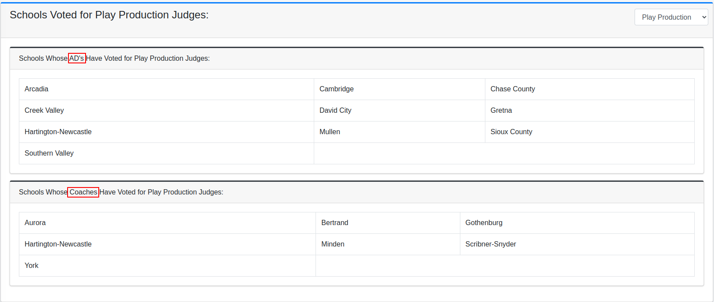
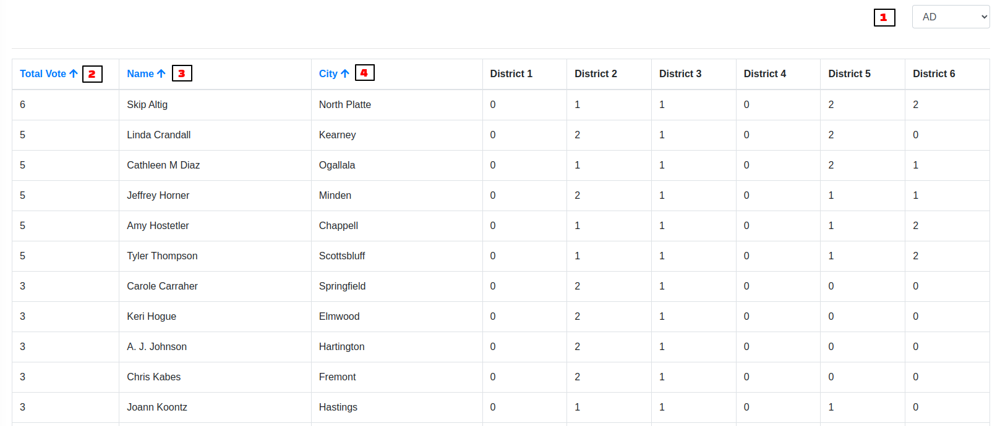

Ballots Reports
===========================

======================
1. Accessing the Ballots:
======================

.. image:: ../../../images/ballots/reports/1.ballots.png
   :alt: Ballots Section

* Begin by navigating to the ballot section where you can manage and review judging assignments.

======================
2. Selecting Judge Types:
======================

* Use the dropdown menu to choose the appropriate judge type, such as **Speech** or **Play Production**. This selection filters the data relevant to the chosen event.

======================
3. Ballot Report Types with Home Button
======================

* The interface provides a dropdown menu that allows users to select different types of ballot reports. This menu is accompanied by a **Home button** for easy navigation. The Home button enables users to return to the **previous** dashboard.

======================
4. Selecting Schools that Have Voted:
======================

* Select the option to view **Schools Who Have Voted** from the dropdown menu.

* The system will display a list of schools where the **ADs** and **coaches** have cast their votes.

======================
5. Viewing Total Votes
======================

* Select the **Total Vote** option from the dropdown menu.

* The system will show the **total number of votes** cast along with relevant details, such as the name of the **school**, the **city**, and the number of votes for specific districts **(Districts 1-6)**.

   **=> Vote Breakdown for ADs and Coaches**

      * Users can drill down into the voting results to view specific votes for **ADs** or **Coaches**. This provides detailed insight into who has participated in the voting process.

      .. image:: ../../../images/ballots/reports/8.reports-for-whom-edit.png
         :alt: Report for Whom Edit

      * Additionally, there is an option to view **All Votes**. This combines both AD and coach votes into a single, comprehensive report, making it easier to get an overall view of the voting results.

======================
6. Sorting Features for Names, Cities, and Votes
======================

   **i. Alphabetical Sorting for Names and Cities**

      * Click on the **Name** or **City** column headers to sort the list alphabetically (A-Z).
      * Click again to sort in reverse order (Z-A).

      .. image:: ../../../images/ballots/reports/9.sorting.png
            :alt: Sorting

   **ii. Numerical Sorting for Total Votes**

      * Click on the **Total Vote** column header to sort the list in ascending order (smallest to largest).
      * Click again to reverse the order, showing the largest votes first.

This feature helps users quickly locate specific schools or individuals based on their names or location.

