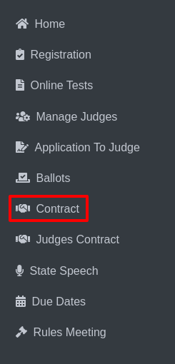

Advanced Search
=======================================

* From the sidebar, select Contracts.

* The page will display a dropdown menu with activities such as Play Production and Speech.

.. thumbnail:: ../../../images/contract/advanceSearch/contract-page-2.png

* Select Play Production from the dropdown.

.. thumbnail:: ../../../images/contract/advanceSearch/contract-menu-3.png
    :width: 200px

* The Play Production District Host Info and Contract Status page will appear with detailed information.

.. thumbnail:: ../../../images/contract/advanceSearch/status-3.5.png

* On the District Host Info and Contract Status page, locate the Advanced Search button at the top right corner.

* Click on the button to proceed.

.. thumbnail:: ../../../images/contract/advanceSearch/advance-4.png
    :width: 300px

* The Applications to Host Advanced Search page will be displayed.

.. thumbnail:: ../../../images/contract/advanceSearch/aplications-5.png

* On this page, select the desired Activities and Schools from the dropdown menus.

* After making your selections, click the Go button.

* The Schools Who Have Not Submitted Applications to Host for the Following Activities page will open, listing relevant schools.

.. thumbnail:: ../../../images/contract/advanceSearch/who-have-6.png

* On the Schools Who Have Not Submitted Applications page, click on the Print ALL Applications to Host button.

* This action will open the Application to Host a 2024-2025 District/Sub-District Event page, where you can review the application details.

.. thumbnail:: ../../../images/contract/advanceSearch/app-to-host-7.png

