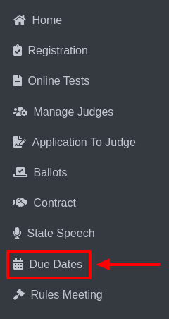

Due Dates
=============

* Select **Due Dates** from the sidebar.

* **Two** types of information will be displayed:

**1. Due Dates Information:**

* This section includes due dates for:

    **i. Application to Judge**

    .. thumbnail:: ../../../images/due-dates/app-to-judge-2.png

    **ii. Online Registration**

    .. thumbnail:: ../../../images/due-dates/online-reg-3.png

    **iii. Online Test**

    .. thumbnail:: ../../../images/due-dates/online-test-4.png

    **iv. Host Contract Details**
    
    .. thumbnail:: ../../../images/due-dates/host-5.png

    **v. Online Ballots**
    
    .. thumbnail:: ../../../images/due-dates/online-ballot-6.png

* You can update the dates for any of the above items by modifying them directly.

* An example is provided to illustrate the changes, showing the dates **before** and **after** the update.

**Before:**

    .. thumbnail:: ../../../images/due-dates/apps-to-judge-before-6.png

**After:**

    .. thumbnail:: ../../../images/due-dates/apps-to-judge-after-7.png
 
* You can save the updated dates by clicking the Save button.