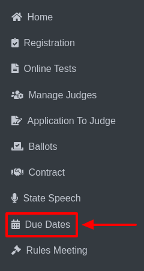

Manage Postseason Dates
========================

* Select **Due Dates** from the sidebar.

* In the top-right corner, there is a button labeled **Manage Postseason Dates**.

.. thumbnail:: ../../../images/due-dates/postseason-8.png
    :width: 400px

* Clicking this button will open the **Manage Postseason Dates** page, which includes:

.. thumbnail:: ../../../images/due-dates/home-9.png

* A Home button for navigation.

.. thumbnail:: ../../../images/due-dates/menu-10.png
    :width: 200px

* A dropdown menu to select sports, such as **Play Production** or **Speech**.

**2. Managing Postseason Dates:**

* Choose a sport from the dropdown menu (**e.g., Play Production**).

.. thumbnail:: ../../../images/due-dates/manage-post-11.png

* The Manage Postseason Dates section for the selected sport will be displayed with the following columns: **Date , Label , Application to Host, Application to Officiate , Lodging , Label Overrides Date , Delete**.

* Update or delete any data by selecting the relevant row and clicking the **SAVE AND DELETE** button.

**Reset Postseason Dates:**

* A **Reset Postseason Dates** button is available on the same page.

.. thumbnail:: ../../../images/due-dates/reset-12.png

* Clicking this button will display a confirmation **pop-up** with the message:

    * "Are you ready to reset?"

    .. thumbnail:: ../../../images/due-dates/popup-13.png
        :width: 300px

* Confirm the action by clicking **Yes** or cancel by clicking **No**.

**Creating New Dates:**

* At the bottom of the page, there is a form to **Create New Date For**.

.. thumbnail:: ../../../images/due-dates/create-14.png

* Fill in the form details and click **CREATE NEW** to save the new date.

