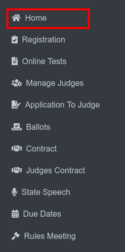

Documents
===========

**Side Menu**

* Click on the Home menu from the sidebar.
 

* The Documents & Links You Have Already Added page will be displayed, featuring five columns:

           1. Active
           2. Link Title
           3. Link URL
           4. Recipients
           5. Delete

.. thumbnail:: ../../../images/home/documents/documents-page-2.png

**Features of the Page:**

* The Link Title and Link URL columns have sorting options to organize the entries alphabetically.

* Example images are provided to illustrate the page before and after sorting.

   **Before:**

   .. thumbnail:: ../../../images/home/documents/sort-before-3.png

   **After:**

   .. thumbnail:: ../../../images/home/documents/sort-after-4.png

* Clicking on the Preview option will display the associated PDF file.

.. thumbnail:: ../../../images/home/documents/preview-5.png

* At the bottom of the page, there is a Save and Delete Changes button.

* After making your selections or edits, click this button to apply and save the changes.

**Creating a New Document:**

* On the same page, in the top-right corner, there is a button labeled Create New.

* To create a new document, click the Create New button.

.. thumbnail:: ../../../images/home/documents/create-6.png

* This will open a form page with a Home button for navigation.

.. thumbnail:: ../../../images/home/documents/form-7.png

* Provide the necessary information in the form fields to create the document.

* A detailed reference image is provided for guidance.

.. thumbnail:: ../../../images/home/documents/creating-doc-8.png

* Once all required details are filled in, click the Save button to create the new document.

.. thumbnail:: ../../../images/home/documents/new-dco-9.png

* The newly created document will be displayed along with a notification confirming its successful creation.

