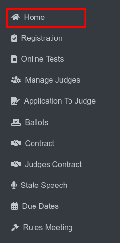
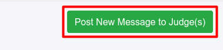

Messages
==========

**Side Menu**
 

Clicking **Home** from the side menu on the message page will redirect the user to the **Home Page**.

**Message Button**

.. thumbnail:: ../../../images/home/messages/message.png
  :title: Message Button.

On the home page, there is a **Message (1)**  button. Clicking it will redirect the user to the message page.

**Message Page**

.. thumbnail:: ../../../images/home/messages/messageHome.png
  :title: Message Page

This page displays messages posted by judges and provides options to manage these messages.

**View Message (No. 1) :** Allows the user to view details of an individual message.

**Edit Message (No. 2) :** Enables the user to edit or update an existing message.

**Delete Message (No. 3) :** Allows the user to delete a message permanently.

**Post New Message (No. 4) :** Click the green button labeled "Post New Message to Judge(s)" to open a form for drafting and publishing a new message.

**View Message**

.. thumbnail:: ../../../images/home/messages/view.png
  :title: View Message

This is the View Page, where users can view detailed messages.

**(No. 1):** Redirects the user to view the attached file of the message.

**(No. 2):** Contains the Edit, Delete, and Index Page buttons for further actions.

**Edit Message**

.. thumbnail:: ../../../images/home/messages/editMessage.png
  :title: Edit Message

This is the Edit Message Page, which is displayed when the Edit button for a specific message is clicked on the Message Page.

**(No. 1) :** The Save button is used to save any edits or updates made to the message. After saving, it redirects the user to the Message Index Page.

**(No. 2) :** It redirects the user to the Message Index Page.

**Post New Message to the Judges**

After clicking this button, the user will be redirected to the Create New Message Form, where user can publish a new message.

**Create Message**

.. thumbnail:: ../../../images/home/messages/createMessage.png
  :title: Create New Message Form.

This page is used to create and post messages to judges. The form allows for specifying message details and optionally sending an email notification to selected recipients.

**Save Message (No. 1) :** Saves the message after all required fields are completed.

**Return to Message Index Page (No. 2) :** Redirects back to the main Message Index Page, where all messages are displayed and can be managed.

**Form Fields Explanation :**

1. Reply to Email: Enter the email address for replies.

2. Subject of Message: The title or headline of the message.

3. Display Message Until: The expiration date for the message.

4. Recipients: Select the target audience (e.g., All Judges or Play Production or Speech).

5. Email Options: Optionally, send the message as an email to all or only registered judges.

6. Message Content: The body of the message.

7. Upload a File: Optionally attach a file with the message.

8. Name of Link: A description for the attached file link.