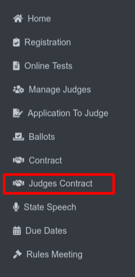

State Contract Assignment
===========================

**Side Menu of Judges Contract**

Clicking **Judges Contract** from side menu, it will redirects the user to the **State Contract Assignment** page.

**State Contract Assignment**
-----------------------------

.. thumbnail:: ../../../images/judges-contract/state-contract-assignment/statepp.png
  :title: State Contract Assignment

To proceed with **"Play Production State Contract Assignment"** the user needs to:

- Click on the **"Select an Activity"** dropdown menu.
- Select **"State Play Production"** from the list of options.
This selection will likely trigger the display of relevant information or options specific to **"State Play Production Contract Assignment."**

|
|

.. thumbnail:: ../../../images/judges-contract/state-contract-assignment/statePP_2.png
  :title: State Play Production Contract Assignments.

This page displays information related to State Play Production Contract Assignments. 
It appears to be a table or list view showing assignments, potentially for judges, including details like posting status,
acceptance, lodging arrangements, and NSAA confirmation.

|
|

.. thumbnail:: ../../../images/judges-contract/state-contract-assignment/links_3.png
  :title: Links and Export.

**Links (Dropdown Menu No. 1):** This dropdown menu likely provides navigation options within the system,

**Export (Button No. 2):** This button allows exporting the list of judges who have accepted their contracts. 
The export format is .xlsx, which is the standard file extension for Microsoft Excel spreadsheets. 
This functionality enables generating a downloadable spreadsheet containing the data from the table.

|
|

.. thumbnail:: ../../../images/judges-contract/state-contract-assignment/links_4.png
  :title: Expend Links.

The dropdown menu with the options "Preview Sample of State Play Production Contract," "Assign State Play Production Judges," 
and "Contract Responses" appears when the user clicks on the "Links" button.

|
|

Preview Sample of Contract
---------------------------

.. thumbnail:: ../../../images/judges-contract/state-contract-assignment/preview_5.png
  :title: Sample of Contract page.

This page appears when the user clicks on the **"Preview Sample of State Play Production Contract,"** from the dropdown.
The contract outlines the details of the event, the judge's responsibilities, compensation, and other important information. 
The judge can review the contract and then **Submit** it to confirm their participation.

|
|

.. thumbnail:: ../../../images/judges-contract/state-contract-assignment/preview_6.png
  :title: Edit Contract page.

This page that appears when user click on "Edit this Contract" in the previous sample contract page.

This page allows for editing the wording of the contract. The instructions at the top explain how to format the text using different tags to change the font style (bold, italic, underline, red).

The rest of the page displays the contract with placeholders for information that will be filled in later, such as the judge's name, event details, and other relevant information. 
Then user have to Click on the **Save Changes** button to save the information.

|
|

Play Production Judges Assignments
-----------------------------------

.. thumbnail:: ../../../images/judges-contract/state-contract-assignment/links_7.png
  :title: Links dropdown.

To access the Play Production Judges Assignments page, the user needs to follow these steps:

- Click on the "Links" dropdown menu. This will reveal a list of options.
- Select "Assign State Play Production Judges" from the list.

|
|

.. thumbnail:: ../../../images/judges-contract/state-contract-assignment/links_8.png
  :title: Play Production Judges Assignments.

The user has arrived at the "Play Production Judges Assignments" page.

As you correctly pointed out, the first step here is to:

- Select the desired "Class/Dist or State" from the dropdown menu. This dropdown allows the user to choose the specific class or district for which they want to assign judges.
Once the class/district or state is selected, the system will likely display a list of judges or provide further options for assigning judges to the chosen category.

|
|

.. thumbnail:: ../../../images/judges-contract/state-contract-assignment/links_9.png
  :title: Play Production Judges Assignments.

This page appears after the user selects a class/district/state from the "Select Class Dist or State" dropdown menu on the "Play Production Judges Assignments" page. 
It allows assigning judges to specific categories within the chosen class/district/state.

**[1] Select Judge (Click to Pick):**
This dropdown menu likely displays a list of available judges.
Clicking on a judge's name will likely redirect the user to a page where they can select judges for specific roles or events.

**[2] Mark Tech (Yes/No):**
This checkbox allows the user to indicate whether the selected judge is also a tech crew member.
Selecting "Yes" might assign them additional responsibilities or qualifications related to technical aspects of the play production.

**[3] Save:**
This button saves the current judge assignment for the selected class/district/state.

**[4] Post to Selected Class Contracts:**
This button likely posts the judge assignments to the contracts for the selected class/district/state.
This action might make the judge assignments visible to the judges and relevant parties.

**[5] Change Class:**
This button allows the user to return to the "Play Production Judges Assignments" page and select a different class/district/state for judge assignments.

**[6] Change Sport:**
This button allows the user to switch to assigning judges for a different sport (e.g., Speech) altogether.

|
|

**This is the Select Judge page**

.. thumbnail:: ../../../images/judges-contract/state-contract-assignment/select_judge.png
  :title: Select Judge.

|
|

Contract Responses
-------------------

.. thumbnail:: ../../../images/judges-contract/state-contract-assignment/links_12.png
  :title: Select Judge.

To access the Play Production Contract Response page, the user needs to follow these steps:
  - Click on the “Links” dropdown menu. This will reveal a list of options.
  - Select “Contract Responses” from the list.

|
|

.. thumbnail:: ../../../images/judges-contract/state-contract-assignment/links_10.png
  :title: Contract Responses.

The user has arrived at the “Contract Responses” page.

As you correctly pointed out, the first step here is to:
  - Select the desired “Class/Dist or State” from the dropdown menu. This dropdown allows the user to choose the specific class or district for which they want to contract responses.

Once the class/district or state is selected, the system will likely display a list of judges or provide further options for assigning judges to the chosen category.

|
|

.. thumbnail:: ../../../images/judges-contract/state-contract-assignment/links_11.png
  :title: Contract Responses.

This page is appears after a user has selected a specific state and class from the previous page.

This page provides an overview of the contract responses from judges for the selected state and class. It likely displays information categorized into different statuses:

  - **Contracts That Have Been ACCEPTED but NOT NSAA-CONFIRMED:** This section lists contracts that have been accepted by judges but are still awaiting confirmation from the NSAA (National Speech & Debate Association).
  - **Contracts That Have Been DECLINED but NOT NSAA-ACKNOWLEDGED:** This section lists contracts that have been declined by judges, but the NSAA has not yet acknowledged the declination.
  - **Contracts That Have Been ACCEPTED and NSAA-CONFIRMED:** This section displays contracts that have been both accepted by judges and confirmed by the NSAA.
  - **Contracts That Have Been ACCEPTED but NSAA-REJECTED:** This section lists contracts that have been accepted by judges but were subsequently rejected by the NSAA.

**[1] Change Class:**
This button allows the user to return to the "Play Production Judges Assignments" page and select a different class/district/state for contract responses .

**[2] Change Sport:**
This button allows the user to switch to contract responses for a different sport (e.g., Speech) altogether.
