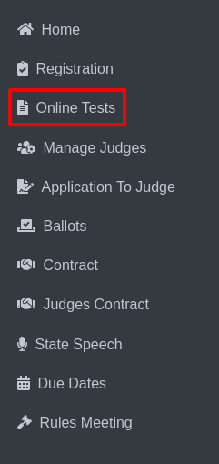

Online Tests Questions
========================

* Select the Online Tests option from the sidebar.

* The Online Test page will be displayed.

.. thumbnail:: ../../../images/online-tests/tests-page-2.png

* Choose an activity such as Play Production, Speech, or Technical Theatre.

.. thumbnail:: ../../../images/online-tests/tests-menu-3.png
    :width: 200px

* For example, selecting Play Production will display the Online Tests Report for Play Production page.

* At the top of the Online Tests Report page, there is a button labeled Questions of Play Production.

.. thumbnail:: ../../../images/online-tests/ques-btn-10.png
    :width: 350px

* Click on this button to navigate to the Questions Page.

* The page displays columns such as: Question, Answer, Reference, Edit, Delete.

.. thumbnail:: ../../../images/online-tests/ques-page-11.png

* You can update any information directly on this page and save your changes by clicking the Update button.

* To edit a specific question, click the Edit option in the fourth column.

.. thumbnail:: ../../../images/online-tests/edit-ques-12.png

* This opens an Edit Question Form where you can modify the question details as needed.

=========================================
Special Features on the Questions Page:
=========================================

.. thumbnail:: ../../../images/online-tests/special-section-13.png

**Create New (1):**

* Click this button to display a form for creating a new question.

.. thumbnail:: ../../../images/online-tests/new-ques-form-14.png

**Import Button (2):**

Clicking this button opens a form for importing questions into the system.

.. thumbnail:: ../../../images/online-tests/import-ques-15.png

**Adding Special Instructions (3):**

* On the Questions Page, there is a + (3) button located at the top.

* Click this button to open the Special Instruction Form.

.. thumbnail:: ../../../images/online-tests/special-instructions-16.png

* The form allows you to add any specific instructions or guidelines related to the questions.

* After entering the necessary details in the form, save the instructions by clicking the Save button.

