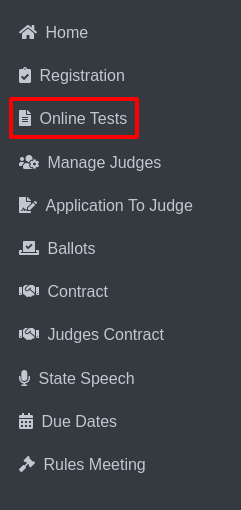

Online Tests Reports
======================

* Select the Online Tests option from the sidebar.

* The Online Test page will be displayed.

.. thumbnail:: ../../../images/online-tests/tests-page-2.png

* Choose an activity such as Play Production, Speech, or Technical Theatre.

.. thumbnail:: ../../../images/online-tests/tests-menu-3.png
    :width: 200px

* For example, selecting Play Production will display the Online Tests Report for Play Production page.

.. thumbnail:: ../../../images/online-tests/play-tests-4.png

* This page includes columns: Remove from View, Name, Date Taken, Score, Missed Questions, Edit Test, Delete

.. thumbnail:: ../../../images/online-tests/delete-5.png

* You can remove or delete rows by selecting them and clicking the corresponding button.

.. thumbnail:: ../../../images/online-tests/rescore-btn-6.png

* The Rescore Play Production Test button allows you to rescore tests.

.. thumbnail:: ../../../images/online-tests/confirm-rescore-7.png
    :width: 300px

* Clicking this button opens a confirmation popup for rescoring.

.. thumbnail:: ../../../images/online-tests/edit-btn-8.png

* Click the Edit Test option to navigate to the Play Production Rules Examination page.

.. thumbnail:: ../../../images/online-tests/edit-tests-page-9.png

* This page includes:

    * A dropdown menu to view the total number of questions.
    * A Finish button to complete the examination.
    * A Save button to save your progress or changes.

