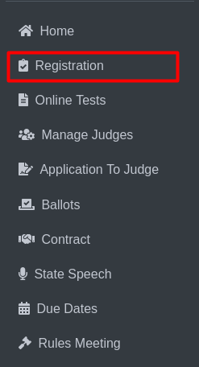
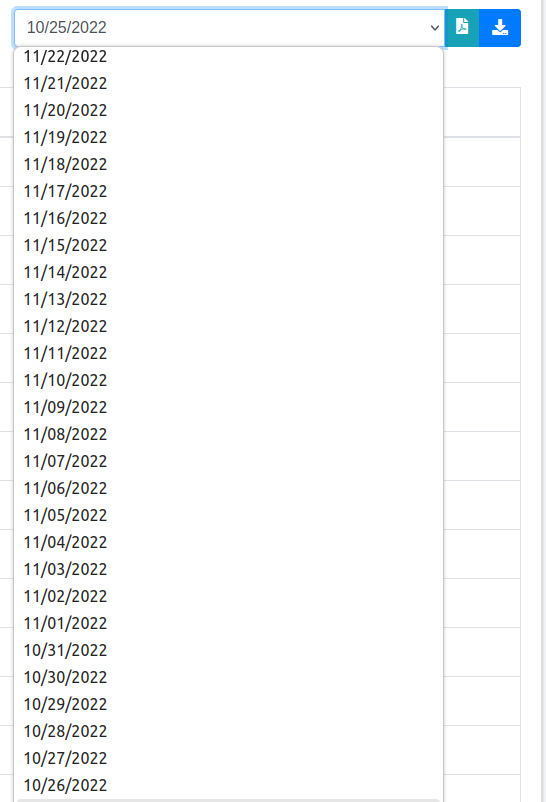

Registration
=========================

**Side Menu**
 

Clicking **Registration** from side menu this will redirects the user to the **Submitted Officials & Judges Online Registration Forms** page.

**Registration Page**

.. thumbnail:: ../../../images/registration/registration.png
   :title: Registration page

**Official’s Name (No. 1):** Clicking on the official’s name opens a detailed view of their application and payment details.

.. thumbnail:: ../../../images/registration/payment_1.png
   :title: Application and Payment details.

This is the Application and Payment details for a specific Official's.

**Date picker (No. 2)** for filtering the list by transaction date. Users can select a specific date to view only the submissions made on that day.
After selecting a date, the list refreshes to show only records that match the specified transaction date.

**(No. 3)** Exports the current view of the Submitted Officials & Judges Online Registration Forms as a PDF document. Only the details shown in the current filtered view.

**(No. 4)** Exports the current view of the Submitted Officials & Judges Online Registration Forms as an XLSX (Excel) file. Only the details shown in the current filtered view.