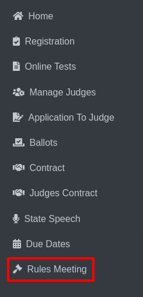

Rules Meeting
================

* Click on Rules Meeting from the sidebar.
 

* The Rules Meeting page will be displayed.

.. thumbnail:: ../../../images/rules-meeting/rules-meeting-page-2.png

* Click on the dropdown menu and select an activity such as Attendance, Payments, or Lookup.

.. thumbnail:: ../../../images/rules-meeting/menu-3.png
    :width: 200px

**➡️ Attendance Page Details:**

* Begin by selecting Attendance.

.. thumbnail:: ../../../images/rules-meeting/click-attend-4.png
    :width: 200px 

* By default, Officials & Judges and Play Production are selected.

.. thumbnail:: ../../../images/rules-meeting/attednce-type-5.png
    :width: 340px

* If not already selected, manually choose them from the dropdown menu.

.. thumbnail:: ../../../images/rules-meeting/officials-and-judges-6.png
    :width: 200px

.. thumbnail:: ../../../images/rules-meeting/sports-7.png
    :width: 200px

* The page will display a table with the following columns:

    **View, Sport, Date/Time Completed, Name, Head Coach?, Check if Viewed, Notes**

    .. thumbnail:: ../../../images/rules-meeting/attendance-page-8.png

    * A Delete option in the View column.
    * A Save button for saving changes.

* The Name column can be sorted alphabetically.

* Example images are provided to demonstrate the table before and after sorting.

**Before:**

.. thumbnail:: ../../../images/rules-meeting/before-sort-9.png
    :width: 200px

**After:**

.. thumbnail:: ../../../images/rules-meeting/after-sort-10.png
    :width: 200px

**➡️ Accessing the Payments Page:**

* Select Payments from the dropdown menu.

.. thumbnail:: ../../../images/rules-meeting/pay-11.png
    :width: 200px

* The Payments page will be displayed.

* The page includes a dropdown menu with the following options:

    Officials & Judges, Play Production, Select a Date

.. thumbnail:: ../../../images/rules-meeting/pay-page-12.png

* The table on this page includes the following columns:
    
    Delete from View, Sport, Transaction Receipt, Name, Head Coach?, Check if Viewed, Notes

.. thumbnail:: ../../../images/rules-meeting/no-data-13.png

* Currently, no data is available in the table.

* The page includes a feature labeled View ALL Transactions, which allows you to view all transactions, including those that have been previously deleted from the view.

