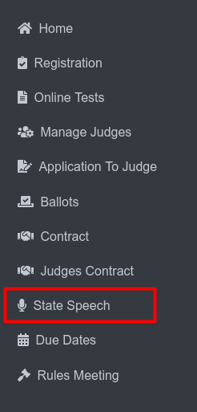

Speech District Results
===========================

**Side Menu**
 

Clicking **State Speech** from side menu this will redirects the user to the **State Speech** page.

.. thumbnail:: ../../../images/statespeech/resultpage.png
   :title: Speech District button.

This page is dedicated to managing State Speech information, providing navigation to specific functionalities.

The button labeled **View Submitted District Speech Results (1)** redirects the user to the Speech District Results page.

.. thumbnail:: ../../../images/statespeech/result.png
   :title: Speech District Results.

This page displays the Speech District Results, providing users with access to results in HTML and CSV formats for various districts.

**No. (1)** redirects the user back to the State Speech Index Page.

The clickable link **"Speech Page on the NSAA Website" (2)** redirects to a written page providing more context or details about speech results.