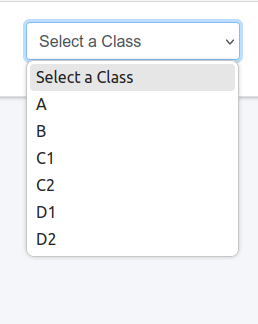
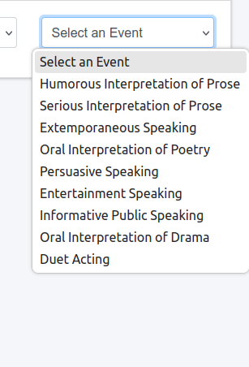

View/Assign Judges & Contestants
======================================

**Side Menu**
 
.. image:: ../../../images/statespeech/sidemenu.png
   :alt: Speech State Side Menu.

Clicking **State Speech** from side menu this will redirects the user to the **State Speech** page to View/Assign Judges & Contestants.

.. thumbnail:: ../../../images/statespeech/view/viewAssign.png
   :title: Speech State selection.

- **Step 1:** From the State Speech menu, choose the option **"View/Assign Judges & Contestants"** (marked as 1).

- **Step 2:** Use the Select a Class dropdown (marked as 2) to pick the desired **Class**.

- **Step 3:** Then, choose a specific event using the Select an **Event** dropdown (marked as 3).

Once selections are made, the page will load the relevant data to proceed with assigning judges and contestants for the selected class and event.

To View/Assign Judges & Contestants, the user first needs to select the **Class** from the dropdown menu.

To View/Assign Judges & Contestants, the user needs to select the **Event** from the dropdown menu.

.. thumbnail:: ../../../images/statespeech/view/viewpage.png
   :title: View/Assign Judges & Contestants.

- **No. 1: Select the Judge:**

Users can assign judges to each room by entering their names in the "Judge" input fields for each round and room.

- **No. 2: Swap:**

This button allows swapping assignments between rooms or rounds, facilitating quick adjustments.

- **No. 3: Shuffle Students:**

Clicking this button automatically assigns students to the available rooms for all rounds.

- **No. 4: Select Final Judges:**

Users can assign specific judges for the finals by entering their names in the "Finals Judges" section.

- **No. 5: Select Class:**

A dropdown menu to select the class (e.g., B) for which the assignments are being managed.

- **No. 6: Select Event:**

A dropdown menu to select the specific event (e.g., Humorous Interpretation) for which judges and contestants are being assigned.

.. thumbnail:: ../../../images/statespeech/view/judge.png
   :title: Select judge page.

After clicking **"Select Judge"** (1) this page will be displayed. To close this page click on the **(X)** button.
